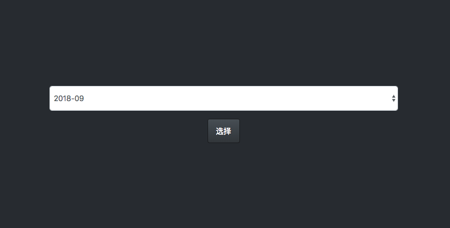
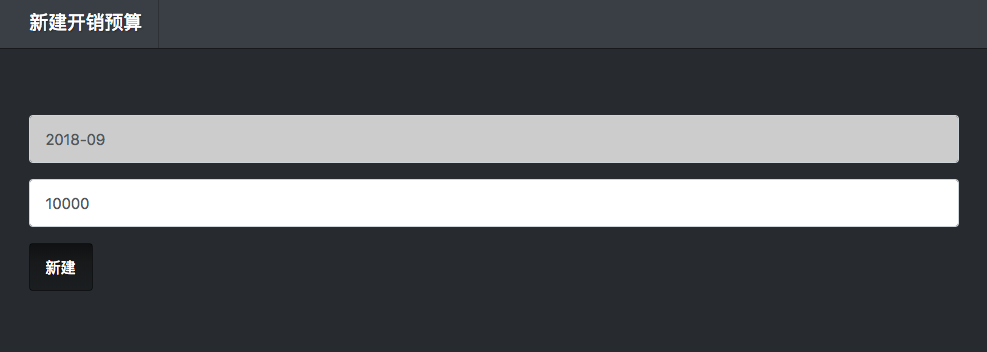
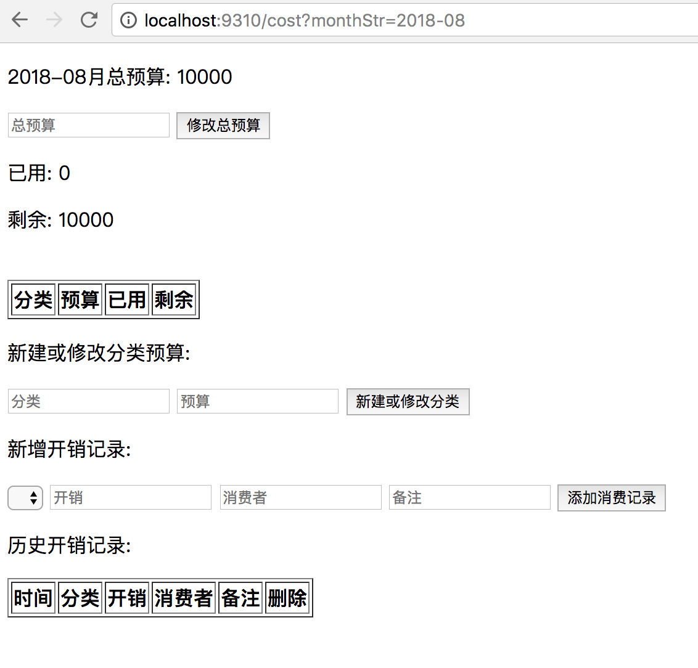

# cost
This is a tool for myself to manage my spending.

### Framework
springboot, thymeleaf  

### how to run
1. install jre/jdk, mvn
1. mvn install
1. java -jar cost-1.0-SNAPSHOT.jar    
    > or:   
        1. put `cost-1.0-SNAPSHOT.jar` and `init_cost.sh` into one folder
        2. then run `init_cost.sh`
1. open url :
    > [cost](http://localhost:9310)

### how to use
1. open index page, choose a month
  
1. if you have not add budget to this month, then you should new one 

1. when a budget is initialized, you can add cost, add budget category and so on
